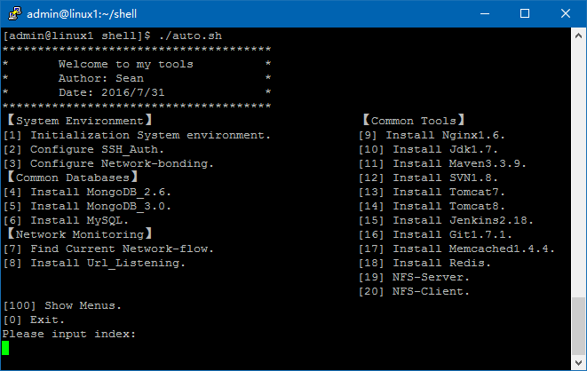

# Centos运维常用工具
# 前言

本工具集包含有系统内核参数优化，ssh证书登录，网卡聚合，mongodb/mysql数据库安装，网络监控以及J2EE开发常用工具安装。以上工具集均为centos中常用的配置与工具，经过本人上一份工作，运维20多台分布式服务器，安装过50次以上linux的实践经验，收集整理出这套常用的服务器管理配置，在我后续的工作中发挥了巨大的价值，提升了N倍工作效率。
当然这个过程中，离不开向专业的运维工程师请教，向度娘和谷哥咨询，后续也会不断的更新和改善这套工程集，使得工具包含的更加齐全和便捷。本工具集适用需要经常部署WEB环境的伙伴使用。

申明：本人原本想成为一名Java工程师，却成为了一名前端工程师（h5/angularJs/css3），最后其实做的是全栈的工作。所以分享的内容不一定非常专业有深度，但是乐意将自己所经历过的东西与大家分享，希望可以给大家带来帮助，如有错误欢迎批评指正。

另外：以上核心参数优化，比较适合WEB应用和数据库服务器的配置，其它用途的服务器建议先了解参数的含义，修改参数后再使用，因为不同的服务
也许有更合适的参数。

**下载代码后，给文件加可执行权限：chmod -R +x shell/* **
##1. 功能列表
--执行auto.sh--

##2. 功能列表说明

###2.1 【System Environment】系统环境
* Initialization System environment   系统内核参数优化，提升运行效率。
* Configure SSH_Auth   配置SSH证书登录，authorized_keys是公钥，client_rsa是私钥，需要自己生成替换例子中的两个文件。
* Configure Network-bonding   配置网卡聚合，需要把network/network-bonding.sh中聚合的IP改成自己的IP。

###2.2 【Common Databases】常用数据库
* Install MongoDB_2.6   安装Mongodb2.6版本 （后续会将集群配置及优化脚本补上）
* Install MongoDB_3.0   安装Mongodb3.0版本 （后续会将集群配置及优化脚本补上）
* Install MySQL   安装Mysql 5.1.3版本

###2.3 【Network Monitoring】网络监控
* Find Current Network-flow   显示当前服务器网卡流量状态
* Install Url_Listening   这是一个比较奇葩的功能，一般用于解决限于水深火热之中的问题；用于监听一个URL，当返回的内容中，包含某个关键内容时，可执行指定的操作。
###2.4 【Common Tools】常用工具

* Install Nginx1.6   安装Nginx1.6版本
* Install Jdk1.7   安装JDK1.7版本，也可以修改app/java/install_JDK.sh中wget源的地址，改成自己需要安装的任意JDK版本
* Install Maven3.3.9   安装Maven3.3.9版本
* Install SVN1.8   安装Subverion1.8版本,如果想装其作为SVN服务端，可执行service httpd restart
* Install Tomcat7   安装Tomcat 7版本
* Install Tomcat8   安装Tomcat 8版本
* Install Jenkins2.18   安装Jenkins2.18版本
* Install Git1.7.1   安装Git1.7.1版本
* Install Memcached1.4.4   安装Memcached1.4.4版本
* Install Redis   安装Redis2.8.7版本
* NFS-Server   安装NFS服务器
* NFS-Client   安装NFS终端

##3. 操作说明
输入相应的序号即可执行操作。